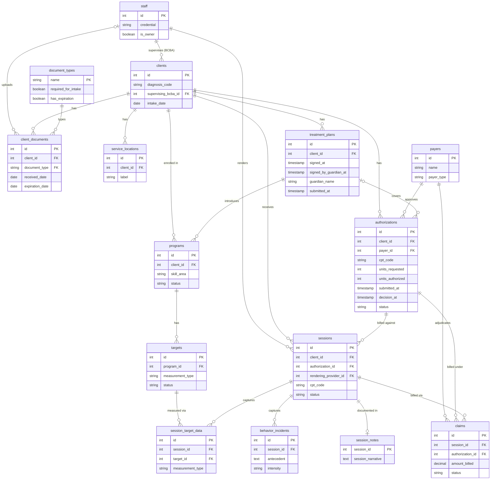

# ABA Clinical Data Platform

A synthetic-data clinical platform modeling a small ABA practice — schema, 
seed data, and (eventually) orchestration, transformation, and analytics layers. 
Built as a portfolio project pairing AI pair-programming with an ABA subject-
matter expert and years of data work.

## Project status

Currently: schema and reference seed data are complete. Synthetic transactional 
data generation, dbt transformations, and the analytics layer are next.

## Disclosure

All clients, clinicians, and clinical data in this repository are synthetically 
generated to resemble real ABA documentation without representing any real 
person or practice. No PHI is used or shared.

## Running locally

1. Clone this repository.
2. Copy `.env.example` to `.env` and set your own values.
3. Run `docker-compose up -d`. The database will start with reference data loaded.

## Workflow ER Diagram (Schema v3)

Workflow-oriented entity-relationship diagram for the ABA clinical data platform. Pure lookup tables (`cpt_codes`, `staff_credentials`, `skill_areas`, `intervention_types`, `place_of_service_codes`) and the `audit_log` are omitted to keep the focus on entities that move data through the case lifecycle. Cardinalities follow crow's-foot notation: `||` = exactly one, `o|` = zero or one, `o{` = zero or more.

**New or modified in v3:**
- `document_types` lookup table (new)
- `client_documents` table (new)
- `authorizations.units_requested` (new) — what the BCBA asked the payer for
- `authorizations.units_authorized` (now nullable) — what the payer granted; NULL while pending or denied
- `authorizations.submitted_at` (new) — when the request went out
- `authorizations.decision_at` (new) — when the payer responded
- `treatment_plans.signed_by_guardian_at` (new) — parent signature timestamp, gates payer submission
- `treatment_plans.guardian_name` (new)

